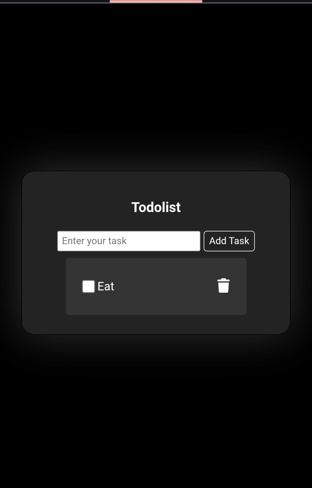

# Todo List App

A simple web-based todo list application to help you manage your daily tasks.

---

## Features

- **Add Task:** Enter your task and click "Add Task" to add it to the list.
- **Complete Task:** Check the box to mark your task as done.
- **Delete Task:** Remove tasks instantly using the trash/bin icon.

---

## How to Use

1. Type a task into the input box.
2. Click **Add Task**.
3. Mark tasks complete by checking the box.
4. Remove tasks by clicking the delete icon.

---

## Technologies Used

- HTML
- CSS
- JavaScript

---

## Example

---

## Screenshot

---

## License

Open-source. Free for personal and educational use.
